# Task: Build a Backend System for an Online Learning Platform

This is a Python Django-based online learning platform test project where users can enroll in courses, view course materials, and track their progress.

## Prerequisites

Before you begin, ensure you have the following installed on your local machine: # On Windows

- Python
- pip
- XAMPP (or any other MySQL server)
  - Create a MySQL database named `olp_db`
- Postman or any other API Platform/ or Postman VS extensions

## Installation

1. Clone the repository:

    ```bash
    git clone https://github.com/Mahfuj-Shohug/OnlineLearningPlatform.git
    ```

2. Navigate to the project directory:

    ```bash
    cd OnlineLearningPlatform
    ```

3. Create and activate a virtual environment:

    ```bash
    python -m venv pyenv
    pyenv\Scripts\activate  
    ```

4. Install dependencies:

    ```bash
    pip install -r requirements.txt
    ```

    If you encounter any errors during installation, upgrade pip and try again:

    ```bash
    pip install --upgrade pip
    pip install -r requirements.txt
    ```

5. Run database migrations:

    ```bash
    python manage.py makemigrations
    python manage.py migrate
    ```

6. Load initial data:

    ```bash
    python manage.py loaddata initial_data.json
    ```

7. Start the development server:

    ```bash
    python manage.py runserver
    ```

8. Open your web browser and navigate to http://localhost:8000 to access the application where it will be define the all urls for this project.

## Usage URL

- Visit the homepage: (http://localhost:8000) to view the all instruction and API URL.

## URLs

### Course API
- Get all courses: (GET) (http://localhost:8000/courses)  # Also can be filtered with title, instructor, price & duration
- Get course by ID: (GET) (http://localhost:8000/courses/<course_id>)
- Create a new course: (POST) (http://localhost:8000/courses/create)

### Enrollment API
- Enroll a student: (POST) (http://localhost:8000/enrollments)
- Validate enrollment: (POST) (http://localhost:8000/enrollments/validate)

### Testing with Postman

1. Also have Postman collection file in the project root folder: [Online Learning Platform.postman_collection.json]
2. Open Postman.
3. Click on the "Import" button in the top left corner.
4. Select the [Online Learning Platform.postman_collection.json] file.
5. Once imported, you will see the "Online Learning Platform" collection in your Postman workspace.
6. Click on the collection to expand it and view the available requests.
7. You can now test the API endpoints by sending requests using Postman.


## Some Test Cases with Proper Screenshots

### Testing the `get_courses` Function (GET Method)

1. Send a GET request to the `/courses` endpoint.
2. Verify that the request is successful and returns the list of courses.
3. Below is a screenshot of the response:

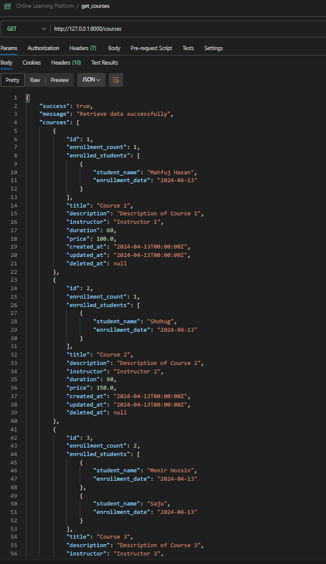

### Testing the `filter_courses` (GET Method)

- Send a GET request to the `/courses?duration=90` endpoint.

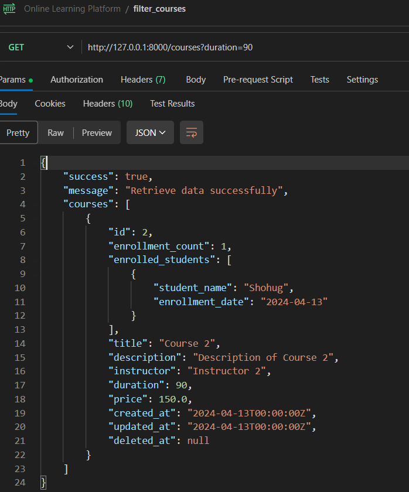

- Send a GET request to the `/courses?price=150` endpoint.

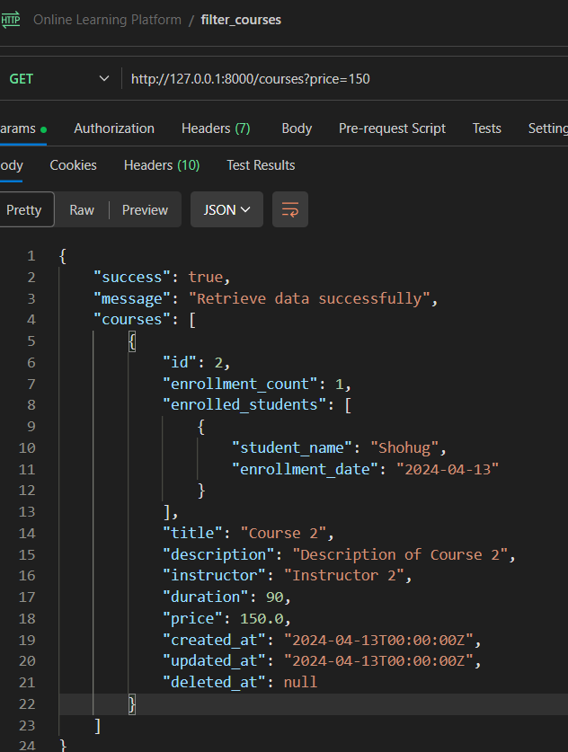

- Send a GET request to the `/courses?instructor=instructor 1` endpoint.

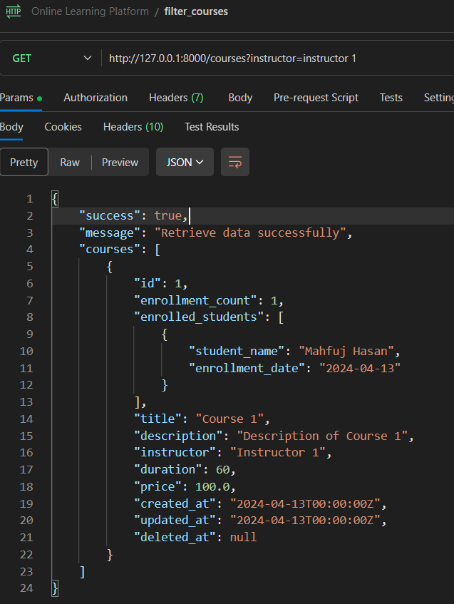

- Send a GET request to the `/courses?instructor=instructor 1&price=100` endpoint.

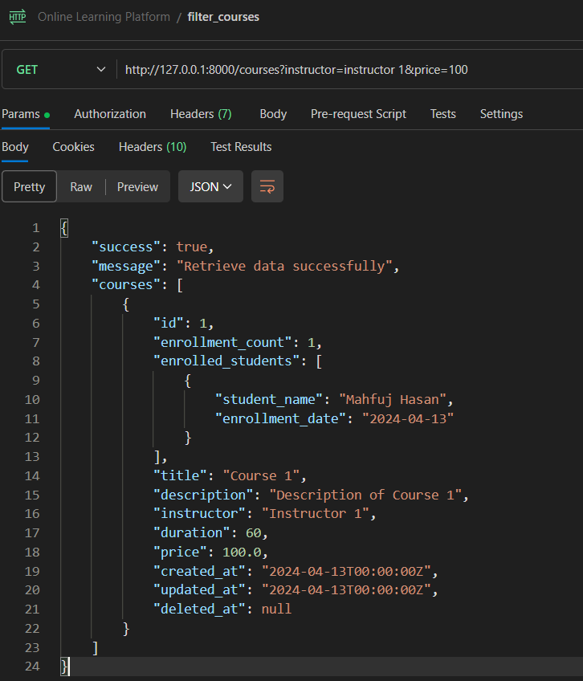

- Send a GET request to the `/courses?instructor=instructor 1&price=1300` endpoint.

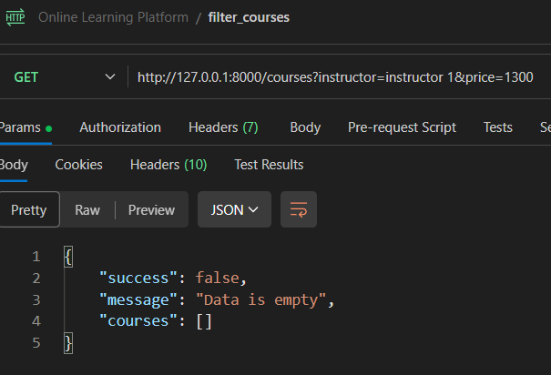


### Testing the `get_course_by_id` (GET Method)

- Send a GET request to the `/courses/5` endpoint.


- Send a GET request to the `/courses/500` endpoint. # Invalid id


### Testing the `create_course` (POST Method)

- Send a POST request to the `/courses/create` endpoint. # custom fields validation 

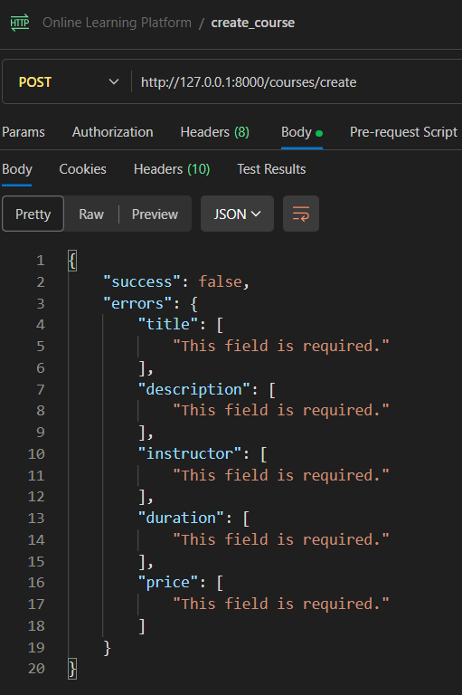

- Send a POST request to the `/courses/create` endpoint. # created successfully

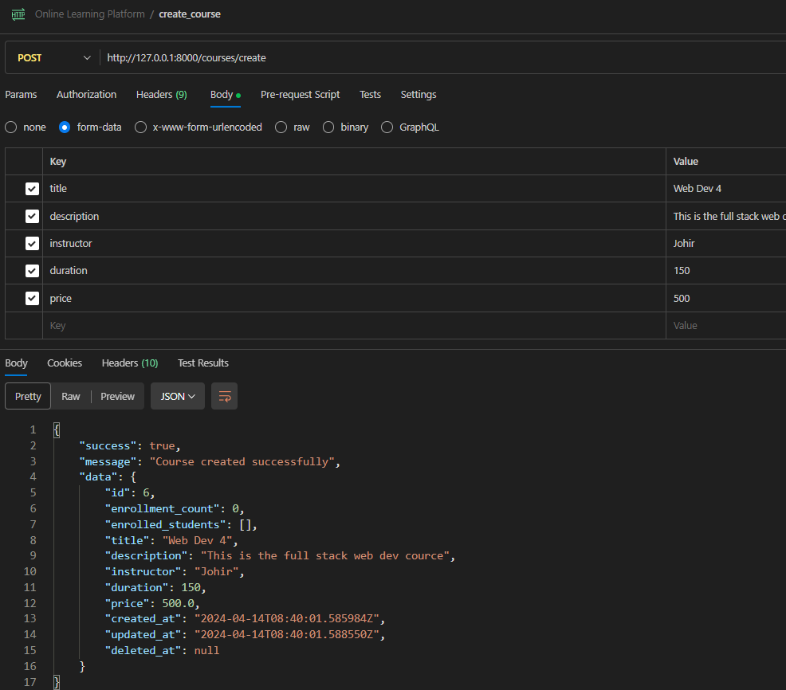

- Send a POST request to the `/courses/create` endpoint. # Already have with same name

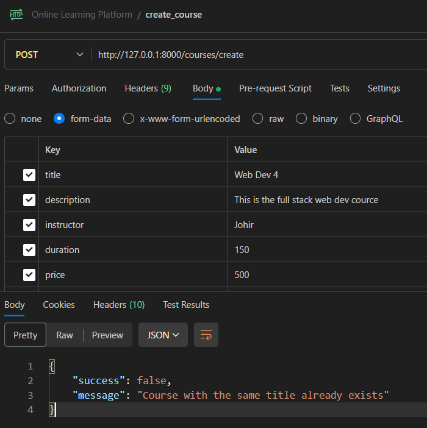


### Testing the `enroll_student` (POST Method)

- Send a POST request to the `/enrollments` endpoint. # custom fields validation 

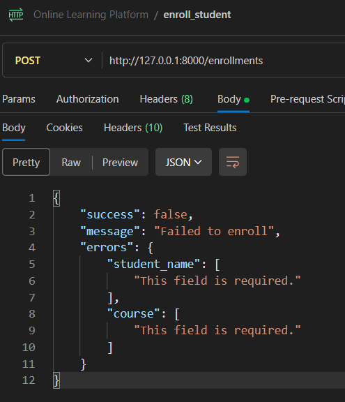

- Send a POST request to the `/enrollments` endpoint. # Enrolled successfully

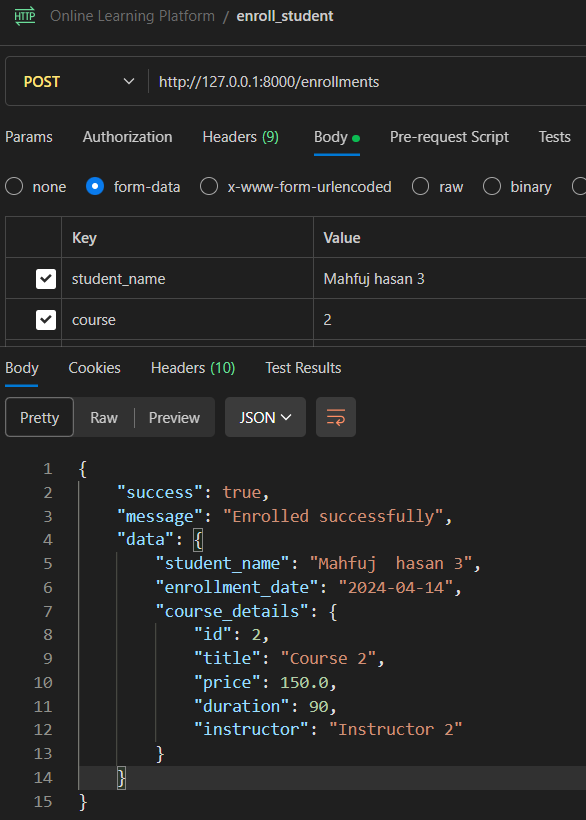

- Send a POST request to the `/enrollments` endpoint. # Already Enrolled

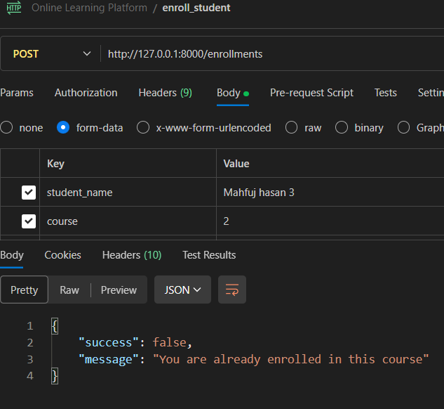

- Send a POST request to the `/enrollments` endpoint. # Invalid course Id

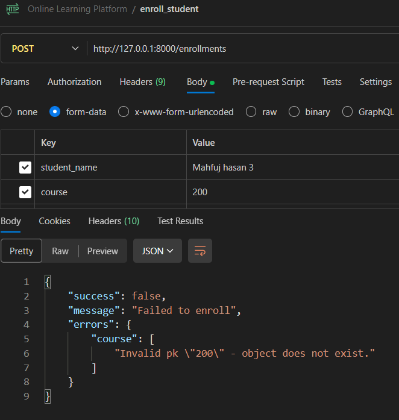